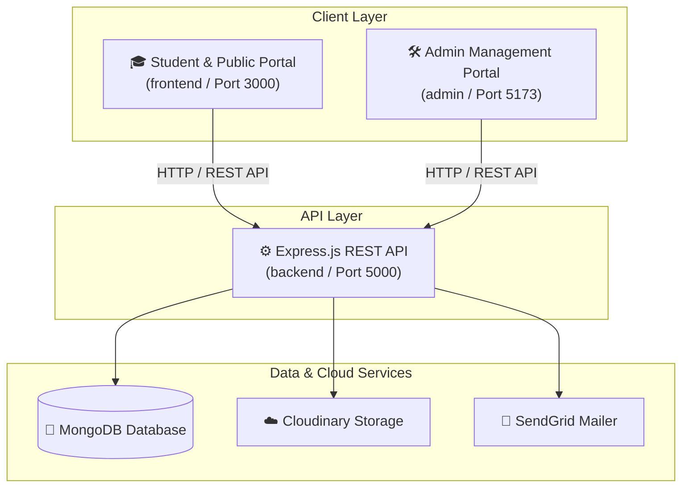

# 🏢 Government OBC & VJNT Boys Hostel Management System (HMS)

> **Empowering Education Through Digital Governance & Transparent Hostel Administration**

---

## 📌 Motto & Vision

The **Government OBC & VJNT Boys Hostel Management System (HMS)** is a full-stack, enterprise-grade digital platform designed to automate and streamline all operations for government hostels catering to students from **Other Backward Classes (OBC)**, **Vimukta Jati (VJ)**, and **Nomadic Tribes (NT)** categories.

### 🌟 Our Mission
- **Transcend Paperwork**: Digitally automate student lifecycle management, room allocations, leave applications, and attendance reporting.
- **Ensure Transparency & Accountability**: Provide real-time audit-ready attendance logs and government reporting via automated Excel exports.
- **Student Welfare First**: Simplify access to hostel facilities, stipend/allowance updates, document verification, and administrative notice broadcasts.

---

## 🏗️ Architecture & Ecosystem

The system follows a modern decoupled architecture consisting of three specialized sub-projects:



---

## 🌟 Key Features

### 🎓 1. Student & Public Portal (`/frontend`)
- 🏠 **Interactive Landing Page**: Modern showcase of hostel infrastructure, mess facilities, library, computer lab, and sports amenities.
- 📜 **Hostel Code of Conduct**: Transparent rules, regulations, and student council directory.
- 🔐 **Student Authentication**: Secure sign-up, login, and JWT-backed session persistence.
- 👤 **Student Dashboard (`/profile`)**:
  - Personal profile management and digital room assignment card.
  - Real-time personal attendance tracking and leave history.
  - Document submission status monitor.
- 📤 **Document Vault (`/uploads`)**: Cloud-based submission of Aadhaar cards, caste certificates, income certificates, college admission receipts, and marksheets.
- 📝 **Online Leave Applications**: Submit out-of-town/medical leave requests directly with parent contact information.

---

### 🛠️ 2. Admin Management Dashboard (`/admin`)
- 📊 **Executive Dashboard (`/dashboard`)**: Instant high-level metrics on total residents, current room occupancy, pending leave approvals, and daily attendance counts.
- 👥 **Student & Room Management (`/users`)**:
  - Full CRUD operations for resident students.
  - Flexible room allocation algorithm supporting room-wise capacity overrides.
  - Comprehensive student directory with search, filter, and sorting by roll number.
- 📋 **Automated Attendance System (`/attendance`)**:
  - Dynamic attendance window enforcement (e.g. evening roll call hours).
  - One-click bulk present/absent tagging.
  - **Excel Audit Exporter**: One-click download of styled, audit-ready monthly/daily attendance reports (`.xlsx`).
- 🚪 **Leave Approval Desk (`/leaves`)**: Real-time review, approval, or rejection of student leave applications with instant status synchronization.
- 📢 **Notice Board Control (`/notices`)**: Broadcast official circulars, event announcements, and hostel notices instantly.
- 📁 **Document Verification Desk (`/uploads`)**: Centralized verification of student-submitted identity and academic documents.
- 👔 **Staff Directory (`/staff`)**: Manage records for hostel wardens, rectors, security officers, and kitchen staff.

---

### ⚙️ 3. Robust Backend API (`/backend`)
- 🔑 **Authentication & RBAC**: JWT stateless auth with role-based authorization middleware ([adminAuth](file:///c:/Users/ADMIN/Desktop/Government_OBC_VJNT_Hostel_Prod/backend/middleware/authMiddleware.js)).
- 📂 **Multi-Provider File Uploads**: Dual local storage & Cloudinary cloud integration via Multer and Streamifier.
- 📊 **ExcelJS Report Generator**: Enterprise Excel sheet builder with automated header formatting, cell styling, and formula summaries.
- ⚡ **Resilient Server Startup**: Auto-detects port availability and fails over gracefully if port `5000` is occupied.

---

## 🛠️ Technology Stack

| Layer | Technologies Used |
| :--- | :--- |
| **Frontend (Student)** | React 18, Vite, React Router v6, React Icons, Vanilla CSS Design System |
| **Admin Dashboard** | React 18, Vite, React Router v6, Lucide React / React Icons, Recharts |
| **Backend API** | Node.js (ES Modules), Express.js, Mongoose ORM |
| **Database** | MongoDB / MongoDB Atlas |
| **File Storage** | Cloudinary API, Multer Storage |
| **Integrations** | SendGrid Mail API, ExcelJS Spreadsheet Engine |

---

## 📁 Repository Structure

```
Government_OBC_VJNT_Hostel_Prod/
├── frontend/                     # Student & Public Web Portal
│   ├── src/
│   │   ├── components/           # UI Components & Landing Sections
│   │   ├── pages/                # Home, Profile, Login, Signup, Uploads, etc.
│   │   └── css/                  # Styling & Custom Design Tokens
│   ├── package.json
│   └── vite.config.js            # Port 3000 with API proxying
│
├── admin/                        # Admin Management Dashboard
│   ├── src/
│   │   ├── pages/                # Dashboard, Attendance, Users, Leaves, Notices
│   │   └── components/           # Admin Layout, Navigation & Sidebar
│   ├── package.json
│   └── vite.config.js            # Port 5173 with API proxying
│
└── backend/                      # Node.js REST API Server
    ├── models/                   # Mongoose Schemas (User, Attendance, Leave, etc.)
    ├── routes/                   # REST API Controllers & Endpoints
    ├── middleware/               # Auth, Upload & Validation Middlewares
    ├── index.js                  # Express App Initializer & Server Entrypoint
    └── package.json
```

---

## ⚡ Quick Start & Setup Guide

### Prerequisites
- **Node.js**: `v18.x` or higher
- **npm**: `v9.x` or higher
- **MongoDB**: Local MongoDB instance or MongoDB Atlas Connection String

---

### 1️⃣ Backend Setup

```bash
cd backend
npm install
```

Create a `.env` file inside the `backend/` directory:

```env
PORT=5000
MONGODB_URI=mongodb+srv://<username>:<password>@cluster.mongodb.net/hms?retryWrites=true&w=majority
ADMIN_USERNAME=admin
ADMIN_PASSWORD=S3cureAdm!nP@ssw0rd
JWT_SECRET=your_super_secret_jwt_key
CLOUDINARY_CLOUD_NAME=your_cloud_name
CLOUDINARY_API_KEY=your_api_key
CLOUDINARY_API_SECRET=your_api_secret
SENDGRID_API_KEY=your_sendgrid_key
EMAIL_FROM=hostel@government.gov.in
```

Start the backend development server:
```bash
npm run dev
```
*(Server will start on `http://localhost:5000`)*

---

### 2️⃣ Frontend Setup (Student Portal)

Open a new terminal window:

```bash
cd frontend
npm install
npm run dev
```
*(Access the student portal at `http://localhost:3000`)*

---

### 3️⃣ Admin Dashboard Setup

Open another terminal window:

```bash
cd admin
npm install
npm run dev
```
*(Access the admin panel at `http://localhost:5173`)*

---

## 📡 Key REST API Reference

| Endpoint | Method | Access | Description |
| :--- | :--- | :--- | :--- |
| `/api/admin/login` | `POST` | Public | Admin login authentication |
| `/api/admin/register` | `POST` | Admin | Register new student resident |
| `/api/admin/users` | `GET` | Admin | Fetch list of all resident students |
| `/api/attendance/mark` | `POST` | Admin/Student | Mark attendance for specified date |
| `/api/attendance/summary` | `GET` | Admin | View room-wise daily attendance breakdown |
| `/api/attendance/download-excel` | `GET` | Admin | Export monthly attendance report as `.xlsx` |
| `/api/leaves/apply` | `POST` | Student | Submit new leave application |
| `/api/leaves/all` | `GET` | Admin | View all student leave requests |
| `/api/leaves/:id/status` | `PUT` | Admin | Approve or reject leave request |
| `/api/notices` | `GET` / `POST` | Public / Admin | Read & publish hostel announcements |
| `/api/uploads/document` | `POST` | Student | Upload student verification document |

---

## 🛡️ Security & Quality Standards

- 🔒 **Encrypted Passwords**: All user credentials are hashed using `bcryptjs` with salt rounds.
- 🛡️ **JWT Authorization**: Stateless authentication tokens passed via HTTP `Authorization: Bearer` headers.
- 🌐 **Proxy Integration**: Development servers automatically forward `/api` requests to backend port `5000`, preventing CORS issues.
- 🧼 **Sanitized Data Indexing**: Unique indexes enforced on `username`, `rollNumber`, and `userId` fields in MongoDB.

---

## 📄 License & Attribution

Developed with ❤️ for the welfare and empowerment of **OBC, VJ, and NT Category Students**.  
*Government OBC & VJNT Hostel Administration System © 2026. All Rights Reserved.*